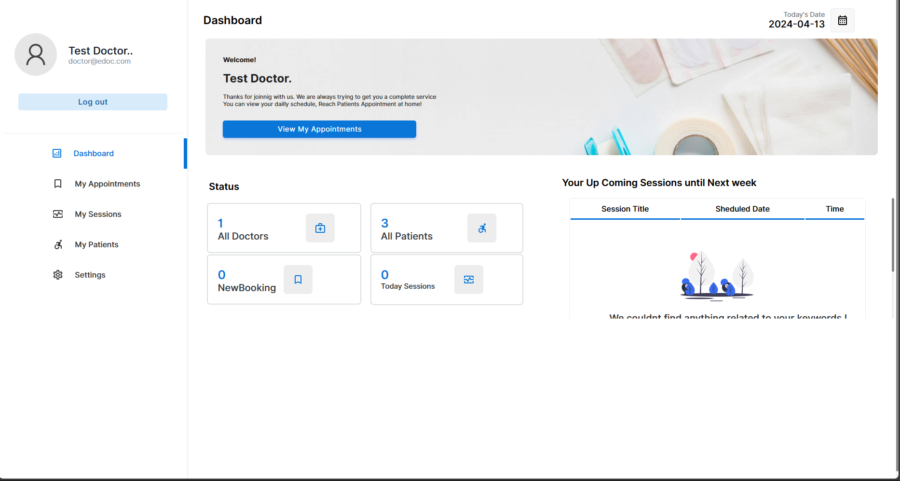

---

# Hospital Management System


An integrated hospital system that streamlines patient records, appointment scheduling, and staff coordination for improved healthcare efficiency.

## Features

- **Patient Records Management**: Secure and efficient handling of patient information.
- **Appointment Scheduling**: Simplifies booking and managing appointments.
- **Staff Coordination**: Facilitates better communication and task management among medical staff.
- **Reporting**: Generates insightful reports for better decision-making.

## Installation

1. **Clone the repository**:
   ```bash
   git clone https://github.com/yourusername/hospital-management-system.git
   ```
2. **Navigate to the project directory**:
   ```bash
   cd hospital-management-system
   ```
3. **Install dependencies**:
   ```bash
   npm install
   ```
4. **Configure the database**:
   - Create a database in MySQL/MariaDB.
   - Import the provided SQL file to set up tables.
   - Update the database configuration in `config/database.js`.

5. **Run the application**:
   ```bash
   npm start
   ```

## Usage

1. **Login**: Access the system using admin or user credentials.
2. **Manage Records**: Add, update, or delete patient records.
3. **Schedule Appointments**: Book, reschedule, or cancel appointments.
4. **Coordinate Staff**: Assign tasks and manage staff schedules.

## Screenshots

### Dashboard


### Doctor Dashboard


### Apointment Manager


### Doctor Session Manager


### Patient Manager


### Settings


### Sign Up


### Database Connected


## Contributing

1. **Fork the repository**
2. **Create a new branch**: `git checkout -b feature-name`
3. **Commit your changes**: `git commit -m 'Add some feature'`
4. **Push to the branch**: `git push origin feature-name`
5. **Create a pull request**

## License

This project is licensed under the MIT License. See the [LICENSE](LICENSE) file for details.

## Contact

- Author: Paul Karanja
- Email: princetrojan@proton.me
- Instagram: [princedelatrojan](https://instagram.com/princedelatrojan)

---
